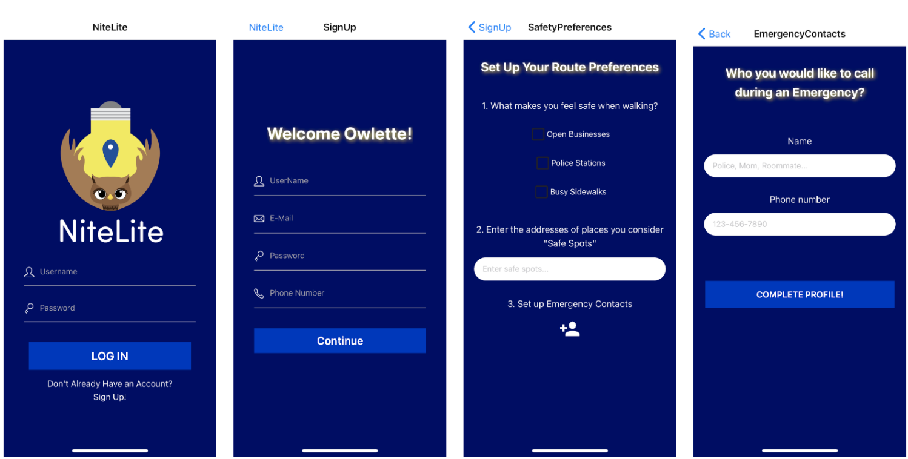

# NiteLite
A React Native project by Maya Pegler-Gordon, Shanaya Nagendran, Lauren Lindsey, and Talia Bahar. 

This repository serves as a parent directory for our NiteLite React project, which is linked below. This repository holds our documentation, Agile workflows, and misc assignments for the 401 course.

### Helpful Links
- [Project Proposal Slide Deck](https://github.com/laurenlindsey1/nitelite/blob/master/project_proposal/NiteLite.pdf)
- [Software Development Folder](https://github.com/laurenlindsey1/nitelite/wiki/SoftwareDevelopmentFolder)
- [NiteLite App Repository](https://github.com/mpeglerg/NiteLite)


## What is NiteLite?
NiteLite is a mobile app designed to help anyone travelling via foot feel safe by providing them with safety information about their route to a destination. niteLite provides users with route information such as the crime rate in their area, lighting on path, nearby user-defined safe spots, open businesses, and busy areas,such that they can feel educated on their surroundings and easily find safe locations to talk to if feeling unsafe while walking. 

## How to use NiteLite
Demo Login Information:

Username:
```
Demo401!
```

Password:
```
Demo401!
```

Demo Video:


###  Installing the software
To install the software, clone the React app Github repository on your computer with the following command:
```
git clone https://github.com/mpeglerg/NiteLite.git
```

Install the Expo app on your mobile device. Our app currently is tested and demoed on an iOS device, so other devices may render our application differently. Feel free to also use Expo's desktop iOS simulator. 

###  Start the software 
To start the software, navigate to the folder where the Github repository has been cloned. Run `npm start` (a prestart script will run both `npm install` and `expo start` for you with this one command). Expo will open up a tab in an internet browser window with a QR Code.

To run using a simulator:
1. Select 'Run on iOS simulator' from the menu bar on the left.

To run using personal smartphone:
1. Install Expo App.
2. Scan the QR code on webpage with your mobile device and the Expo app will open with the most recent version of the application.

### Stop the software
1. Close the Expo app on your mobile device.
2. In you terminal where you ran `npm start` press `CTRL` + `C`. 

This application will not run in the background on your mobile device like Google or Apple Maps do. 

###  Using the software 
####  Logging in for the first time
If you are a new user, you will be prompted to Sign Up and create a NiteLite account. On the first page, you will be prompted to enter a username, email, phone number, and password. Your username will be unique to you, and you must use and email and phone number that isn't associated with any prior NiteLite accounts. Your password must be at least 8 characters and include one lowercase letter, one uppercase letter, and one number. You will then be prompted to select your safety preferences.

If you are a returning user, you will log in with your username and password. 



#### Setting up your preferences
Setting your preferences allows the application to tailor your safest route based off of your preferences. The "What makes you feel safe when walking?" question will allow the app to prioritize routes with the most of what you have selected from "Open Businesses, Police Stations, Busy Sidewalks". We understand different users have different definitions of safety, and we hope to solve this problem by setting user preferences. The next question allows you to enter the addresses of places you define as safe zones. This can be a friend's house, your college campus, or a gas station or late night diner that you are familiar with. When you select these addresses and you are walking on a route near those destinations, they will be highlighted on the map. The final question allows you to set up emergency contacts that can be called if you indicate you feel you are in danger while on your way to your destination. This can be 911, or a trusted friend or family member.

####  Mapping to a destination
To map to a destination, click on the search bar and begin typing in a destination. This can be the name of a place or an address. Once you press enter, you should be able to see the route from your current location to the destination inputted. 

####  Interpreting the map information
On the map, you can see your current location, as well as a walk score from 1-100 on how walkable the area you are in. If the score is higher (ex:90), then you are in a very walkable area. If you are near your selected safe spot, there will be a location marker with a heart on your location. You can click on that if you want to route to that destination. 

We have a share route button, but its full functionality will be implemented in Spring 2021.

####  Changing your destination
To change your destination, click on the search bar and begin typing your new destination of choice. 

####  Uninstalling the software
To "uninstall the software" you can remove the Github folder from your computer, or delete the Expo app. 

###  Troubleshooting
####  Unable to Login?
The development team plans to create functionality for finding your username or resetting your password via email or phone number in Spring 2021. If you have forgotten your login information, feel free to make a new account (with a new email or phone number), or use the demo credentials.

Demo username: `Demo401!`
Demo password: `Demo401!`

####  Feel unsafe and need to call for help?
If you are in the process of going to your destination and you feel unsafe for any reason to the point where you would like to call your emergency contact, click on the phone icon in the lower area of the screen. This will present you with a confirmation of making a phone call and your phone will make a call to your emergency contact. 

#### Other
If you're still having trouble with using our app, feel free to contact a member of our development team:
[Talia Bahar](mailto:tbahar@lion.lmu.edu),
[Lauren Lindsey](mailto:llindse3@lion.lmu.edu),
[Shanaya Nagendran](mailto:snagendr@lion.lmu.edu), and
[Maya Pegler-Gordon](mailto:mpeglerg@lion.lmu.edu).
